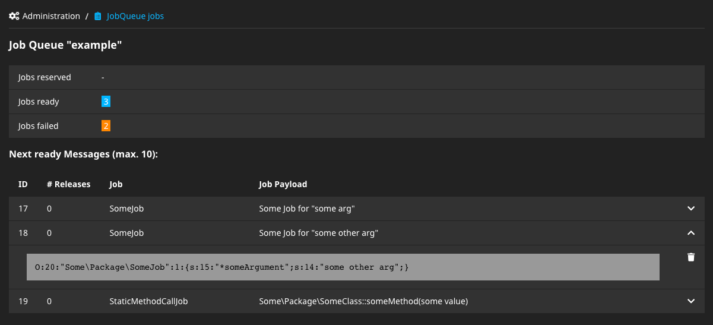

# Wwwision.Neos.JobQueueModule

Neos Backend Module for the [Flowpack.JobQueue.Common](https://github.com/Flowpack/jobqueue-common) packages.



## Usage

Install package via composer:

    composer require wwwision/neos-jobqueuemodule

And navigate to the new `jobs` module at /neos/administration/jobs

*Note:* If the authenticated user doesn't have the `Neos.Neos:Administrator` role, you'll need to grant privileges
in order to access the JobQueue backend module (see below).

### Configuration

This package doesn't require any specific settings, since the behavior is determined via corresponding privileges:

#### Access control

Users with the role `Neos.Neos:Administrator` will have access to the module and all configured JobQueues by default.
To grant editor roles access to specific queues, privileges can be granted via [Policy.yaml](https://flowframework.readthedocs.io/en/stable/TheDefinitiveGuide/PartIII/Security.html#defining-privileges-policies).

In general, users need access to the `administration` module as well as the `administration/jobs` sub module:

```yaml
roles:
  'Some.Package:SomeEditorRole':
    privileges:
      - privilegeTarget: 'Neos.Neos:Backend.Module.Administration'
        permission: GRANT
      - privilegeTarget: 'Wwwision.Neos.JobQueueModule:Module'
        permission: GRANT
```

#### Example 1: Read access to specific queue

To grant a role read access to a specific Job Queue, the `Queues.Specific.Access` privilege can be granted:

```yaml
roles:
  'Some.Package:SomeEditorRole':
    privileges:
      # ...
      - privilegeTarget: 'Wwwision.Neos.JobQueueModule:Queues.Specific.Access'
        parameters:
          queue: 'Some.Queue:Name'
        permission: GRANT
```

With this `Policy.yaml`, users of the corresponding role will have access to a queue `Some.Queue:Name` if that's configured.

#### Example 1a: Grant removing messages of specific queue

In order to allow users to remove pending messages from the queue (i.e. mark them `finished`), the `Queues.Specific.FinishMessages`
can be granted additionally:

```yaml
roles:
  'Some.Package:SomeEditorRole':
    privileges:
      # ...
      - privilegeTarget: 'Wwwision.Neos.JobQueueModule:Queues.Specific.FinishMessages'
        parameters:
          queue: 'Some.Queue:Name'
        permission: GRANT
```

#### Example 2: Read access to all queues

With the `Queues.Any.Access` privilege access to all queues can be granted at once:

```yaml
roles:
  'Some.Package:SomeEditorRole':
    privileges:
      # ...
      - privilegeTarget: 'Wwwision.Neos.JobQueueModule:Queues.Any.Access'
        permission: GRANT
```

#### Example 2a: Grant removing messages of all queues

Similarly, the `Queues.Any.FinishMessages` privileges can be granted to allow finishing of messages in
all accessible queues:

```yaml
roles:
  'Some.Package:SomeEditorRole':
    privileges:
      # ...
      - privilegeTarget: 'Wwwision.Neos.JobQueueModule:Queues.Any.FinishMessages'
        permission: GRANT
```

## Contribution

Contributions in the form of issues or pull requests are highly appreciated.

## License

See [LICENSE](./LICENSE)
